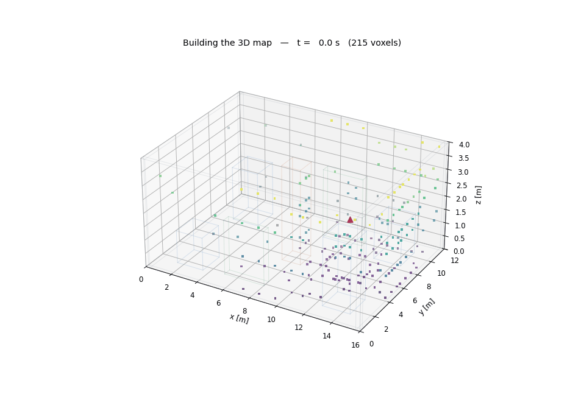
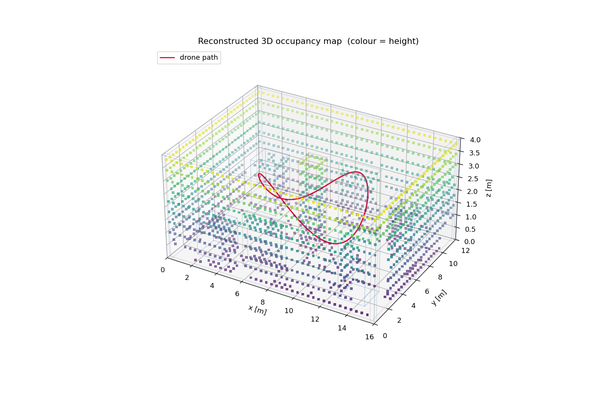
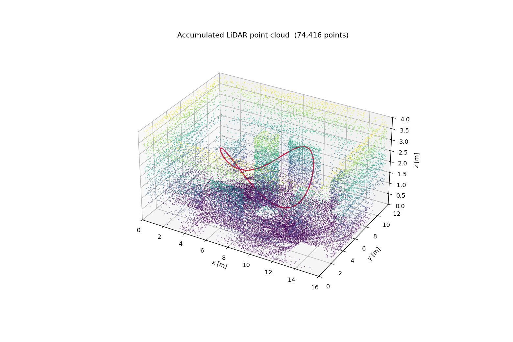
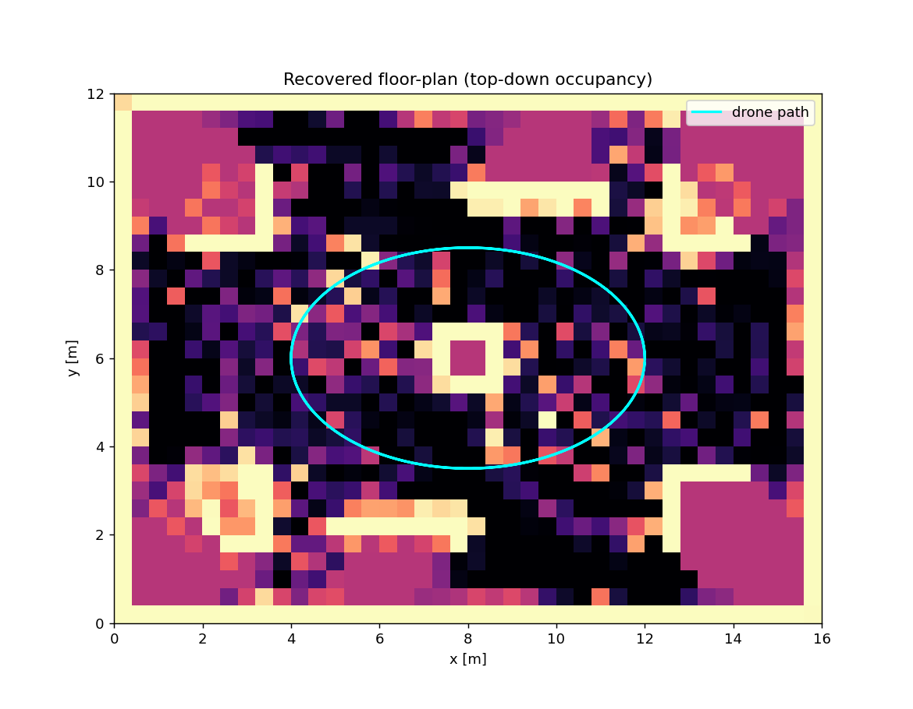
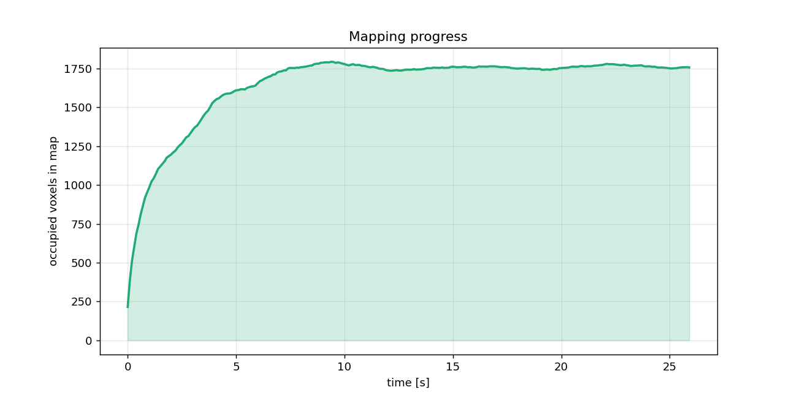

# 3D Robot Mapping

A drone flies an autonomous loop through a room full of **3D walls and
obstacles**, scans the space with a **spherical 3D LiDAR**, and incrementally
builds a **3D occupancy-voxel map** of the world as it explores.

This is the **mapping** half of SLAM (Simultaneous Localization and Mapping):
the robot poses are known, and the goal is to reconstruct the 3D structure of
the environment from noisy range measurements using **log-odds occupancy grid
mapping** — the same idea behind [OctoMap](https://octomap.github.io/).



*Coloured voxels = the map being built (colour = height). Red triangle/curve =
the drone and its flight path. The view slowly orbits the room.*

---

## What happens each step

1. **Fly** — the drone advances along a smooth elliptical loop around a central
   pillar, gently changing altitude (so the trajectory itself is 3D).
2. **Scan** — a 3D LiDAR shoots a grid of `azimuth × elevation` rays. Each ray
   is ray-cast against every wall/obstacle (slab method) and the floor plane,
   returning the nearest surface hit (+ range noise).
3. **Map** — every scan is fused into a voxel grid with the log-odds update:
   - voxels the ray passes *through* get **free** evidence (`l -= l_free`),
   - the voxel at the ray's *end point* gets **occupied** evidence
     (`l += l_occ`),
   - values are clamped so the map stays responsive.
   A voxel is drawn once its log-odds cross the occupancy threshold.

Because the whole scan is processed with vectorized NumPy (ray sampling +
`np.add.at`), the full flight maps in a couple of seconds.

---

## Results

A typical run (`--steps 260 --loops 2`) fuses ~**74,000** LiDAR points into a
`40 × 30 × 10` voxel grid (1.2 m ceiling clearance over a 16 × 12 m room) and
recovers ~**1,750** occupied voxels — the outer walls, the central pillar, the
corner crates and the partition walls.

| | |
|---|---|
| **Reconstructed 3D voxel map** | **Accumulated LiDAR point cloud** |
|  |  |
| **Recovered floor-plan (top-down)** | **Mapping progress over time** |
|  |  |

The top-down view (a max-over-height projection of the occupancy grid) clearly
shows the recovered floor-plan: perimeter walls, the central pillar the drone
orbits, the corner obstacles and the two partition walls.

---

## How to run

### 1. Requirements

Python 3.9+ with the packages in [`requirements.txt`](requirements.txt):

```bash
pip install -r requirements.txt
```

(Anaconda's base environment already includes NumPy, Matplotlib and Pillow.)

### 2. Run the mapper

From the project root:

```bash
python run_mapping.py
```

This flies the drone, builds the 3D map, and writes all plots **and** the
animated GIF to `outputs/`.

Useful options:

```bash
python run_mapping.py --no-anim          # plots only (fast, ~3 s)
python run_mapping.py --steps 400 --loops 3   # fly longer / denser map
python run_mapping.py --stride 3 --fps 20     # smaller / smoother GIF
python run_mapping.py --outdir results        # write elsewhere
```

| Flag | Default | Meaning |
|---|---|---|
| `--steps`  | 260 | number of 0.1 s flight steps |
| `--loops`  | 2.0 | how many times the drone circles the room |
| `--stride` | 2   | keep every Nth step as an animation frame |
| `--fps`    | 15  | GIF frame rate |
| `--no-anim`| off | skip the (slower) 3D GIF rendering |
| `--outdir` | `outputs` | output directory |

---

## Project structure

```
SLAM_Project/
├── environment3d.py    # 3D room: box walls/obstacles, floor, ray-casting,
│                       #   the flying drone, and the spherical 3D LiDAR
├── mapping.py          # OccupancyGrid3D: log-odds 3D voxel mapping
├── run_mapping.py      # simulate flight -> build map -> plots + GIF
├── requirements.txt
└── outputs/            # generated map / point cloud / floor-plan / GIF
```

---

## Outputs

| File | Description |
|---|---|
| `outputs/mapping.gif`    | rotating 3D animation of the map being built |
| `outputs/map3d.png`      | final 3D voxel map + ground-truth wireframe + path |
| `outputs/pointcloud.png` | the raw accumulated LiDAR point cloud |
| `outputs/topdown.png`    | recovered 2D floor-plan (top-down occupancy) |
| `outputs/progress.png`   | number of mapped voxels vs. time |

---

## Extending

- **Change the world** — edit `_build_room()` in `environment3d.py` to add or
  move boxes (each `Box` is an axis-aligned wall/obstacle with its own height).
- **Change the flight** — tune the ellipse / altitude in the `Drone` class.
- **Change the sensor** — `Lidar3D` parameters set the ray count
  (`n_az`, `n_el`), field of view (`el_min_deg`, `el_max_deg`), range and noise.
- **Change map fidelity** — `OccupancyGrid3D(res=...)` sets the voxel size;
  `l_occ` / `l_free` / `clamp` control how aggressively evidence accumulates.

> Note: this models the *mapping* part of SLAM with known poses. To make it a
> full SLAM system you would additionally estimate the drone's pose online
> (e.g. with a Kalman or particle filter) and feed the estimate into the map.
